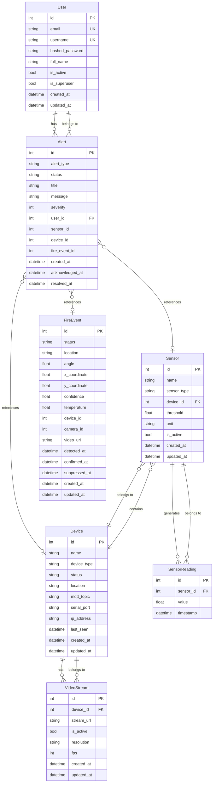

# Entity Relationship Diagram (ERD)

## Fire Detection System Database Schema

## Entity Descriptions

### User
Stores user account information including authentication credentials and profile data. Users can receive alerts.

### Device
Represents physical devices in the system (sensors, cameras, robotic arms, Raspberry Pi units). Tracks device status, location, and connectivity information.

### Sensor
Individual sensors attached to devices. Each sensor has a specific type (temperature, smoke, flame, gas, humidity) and can have threshold values for triggering alerts.

### SensorReading
Time-series data from sensors. Stores individual readings with timestamps for historical analysis.

### Alert
System alerts and notifications. Can be triggered by sensors, devices, or fire events. Alerts can be assigned to users and tracked through their lifecycle (pending → acknowledged → resolved).

### FireEvent
Records fire detection events with location coordinates, confidence scores, and status tracking through the fire suppression process.

### VideoStream
Video stream configurations for camera devices. Stores stream URLs and technical parameters like resolution and FPS.

## Enum Values Reference

### Device.device_type
- `sensor`
- `camera`
- `arm`
- `raspberry_pi`

### Device.status
- `online`
- `offline`
- `error`
- `maintenance`

### Sensor.sensor_type
- `temperature`
- `smoke`
- `flame`
- `gas`
- `humidity`

### Alert.alert_type
- `fire_detected`
- `high_temperature`
- `smoke_detected`
- `device_offline`
- `system_error`

### Alert.status
- `pending`
- `acknowledged`
- `resolved`
- `false_alarm`

### FireEvent.status
- `detected`
- `confirmed`
- `suppressing`
- `suppressed`
- `false_alarm`

## Relationships

- **User ↔ Alert**: One-to-Many (a user can have multiple alerts)
- **Device ↔ Sensor**: One-to-Many (a device can have multiple sensors)
- **Device ↔ VideoStream**: One-to-Many (a device can have multiple video streams)
- **Sensor ↔ SensorReading**: One-to-Many (a sensor generates multiple readings over time)
- **Alert ↔ User**: Many-to-One (alerts can optionally belong to a user)
- **Alert ↔ Sensor/Device/FireEvent**: Many-to-One (alerts can reference sensors, devices, or fire events)

